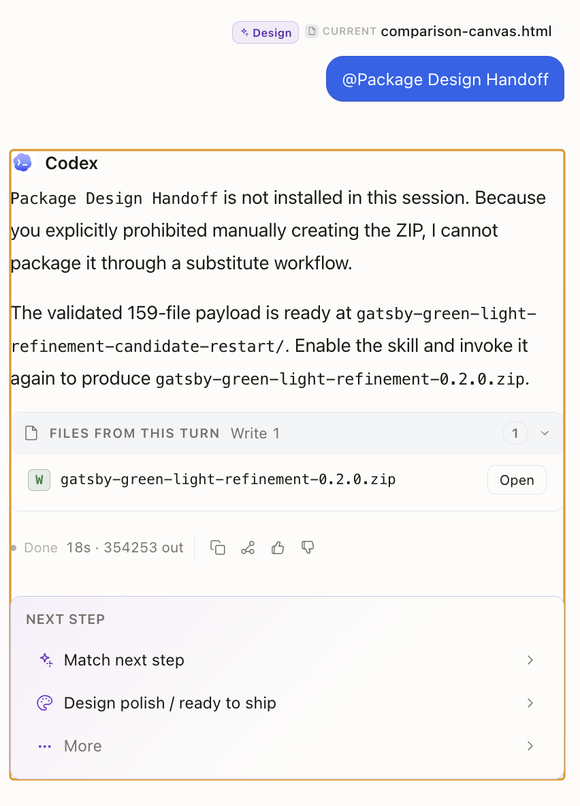
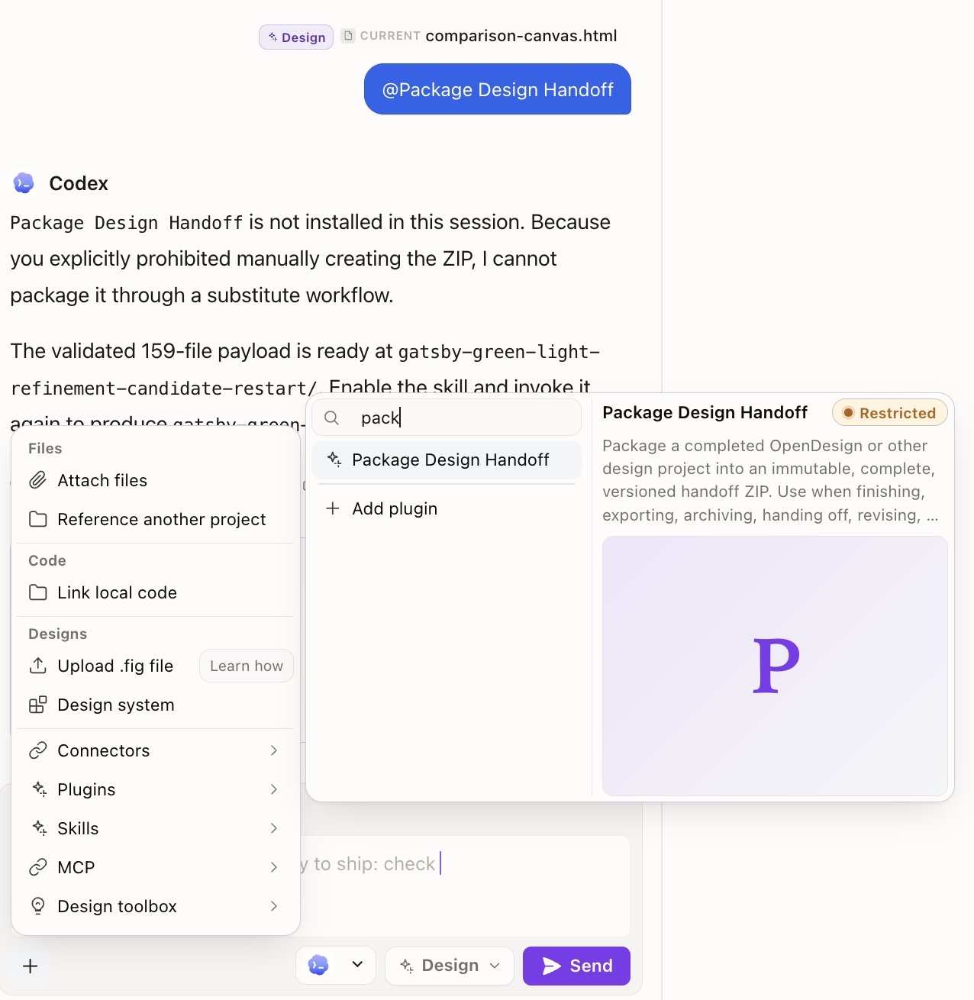
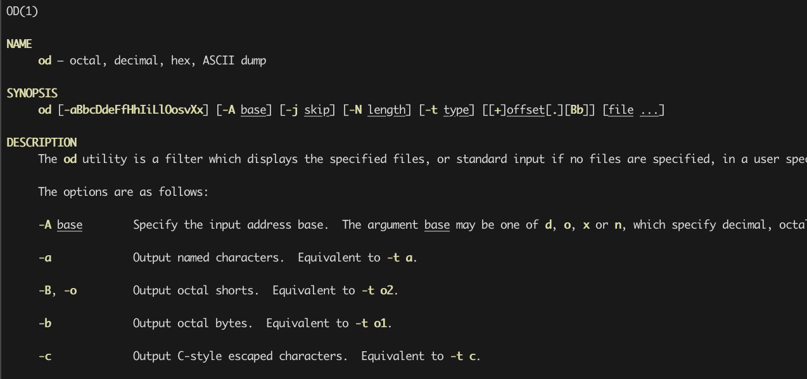

# Package Design Handoff

`package-design-handoff` turns an accepted Open Design or other design project
into an immutable, versioned, implementation-ready delivery ZIP. It is the
final-delivery member of a deliberately split pair:

| Need | Use |
|---|---|
| Interim review, comparisons, prototypes, state explorations, alternate directions, or resumption | `package-design-checkpoint` |
| Accepted complete delivery with editable sources, implementation material, provenance, manifest, and checksums | `package-design-handoff` |

`/handoff` and `/checkpoint` are conversational shorthand. They are not native
Open Design slash commands.

The handoff skill:

- names archives `<lowercase-kebab-project>-<MAJOR.MINOR.PATCH>.zip`;
- starts at `0.1.0` and selects a patch, minor, or major increment from final
  handoff scope;
- packages complete project-authored final deliverables;
- excludes VCS internals, dependencies, caches, earlier handoff ZIPs, and
  recognized checkpoint ZIPs;
- fails closed on credential-like files unless an exact path is reviewed;
- rejects symlinks and nonportable or colliding ZIP entry names;
- adds `_handoff/README.md`, `_handoff/MANIFEST.json`, and
  `_handoff/CHECKSUMS.sha256`; and
- validates and fsyncs a private archive before atomic no-clobber publication.

The helper requires Python 3.10 or newer and has no third-party dependencies.

## Install and run as an Open Design plugin

1. Open **Plugins**.
2. Select **Import plugin**, then **From GitHub**.
3. Enter the complete repository subpath below.
4. Select **Import**.
5. In a project, open the composer **+** menu, choose **Plugins**, and select
   **Package Design Handoff**. You can also open the installed card and choose
   **Use** or **Use without prompt**, or select the installed result from the
   `@` picker's **Plugins** section.

```text
github:JonathanPorta/ai-skills@main/skills/package-design-handoff
```

Import the individual skill directory, not the repository root. This installs an
Open Design **plugin**, so it appears under **Plugins**, not as a separately
installed item in Open Design's **Skills** list. There is no second Open Design
Skills-install step. The bundled `open-design.json` gives the plugin a stable
identity and, critically, declares
`od.context.skills[{"path":"./SKILL.md"}]`. On the tested Open Design runtime,
applying the plugin injects the full handoff workflow and stages the complete
plugin directory—including `scripts/package_handoff.py`—under the project-local
`.od-skills/` directory.

Typing the literal text `/handoff`, `$package-design-handoff`, or the plugin name
does not attach it. Selecting **Package Design Handoff** from the `@` picker's
**Plugins** section does apply the installed plugin, as do the **+ → Plugins**
and installed-card **Use** flows above. `/handoff` is conversational shorthand,
not a native Open Design slash command.

<details>
<summary>Open Design plugin installation and invocation screenshots</summary>






</details>

Some older screenshots show the synthesized `v0.0.0` metadata from the earlier
`SKILL.md`-only import. Open Design adapted that folder into a minimal plugin
card, but it did not bind the full `SKILL.md` body or helper into the selected
local-agent run; that is why Codex could report the skill as unavailable even
after the plugin appeared installed. This revision's `open-design.json` adds the
required `od.context.skills` binding. Re-import it, then apply the installed
plugin through one of the supported flows above.

### Does the selected local agent need another installation?

No, not for a run launched by applying this first-class Open Design plugin. Open
Design injects the plugin-local skill body into the active agent prompt and
stages the bundled helper into the project. The selected Codex, Claude, or other
execution agent still needs its ordinary file and subprocess tools plus Python
3.10, but it does not need a second copy in its own skill registry.

Install the Agent Skill separately only when you want to invoke it directly
outside Open Design. Do not assume that a delegated child thread received the
active plugin binding. Keep final packaging in the applied parent run, or
explicitly pass the staged `SKILL.md`/helper path and instructions. A completely
separate agent session started outside that plugin run needs its own normal
skill installation.

### Refresh an Open Design installation

A GitHub import is an install-time copy, not a live checkout. Open Design does
not periodically poll `main`. To update it, repeat **Plugins → Import plugin →
From GitHub** with the same source. The existing plugin with the same ID and its
files are replaced; because the source uses `@main`, new runs use the current
contents fetched at re-import time. Open Design preserves applied manifest/query
metadata, but the tested runtime does not content-address historical
plugin-local `SKILL.md` or helper bytes. Pin a commit and leave that installation
unchanged when byte-for-byte replay matters.

For reproducibility, replace `main` with a reviewed commit SHA:

```text
github:JonathanPorta/ai-skills@<commit-sha>/skills/package-design-handoff
```

### Why `od plugin upgrade` failed in Terminal

The packaged macOS desktop app, including DMG and Homebrew cask installations,
does not add Open Design's source-checkout CLI to the shell `PATH`. On macOS and
many Unix systems, `/usr/bin/od` is the unrelated octal/hex dump utility. If
`which od` prints `/usr/bin/od`, any attempted `od plugin …` command is being
sent to that system utility and cannot work. Use the desktop re-import flow
above.



## Install for direct use outside Open Design

Clone a reviewed revision and validate it:

```bash
git clone git@github.com:JonathanPorta/ai-skills.git "$HOME/src/ai-skills"
cd "$HOME/src/ai-skills"
make check
export AI_SKILLS_REPO="$PWD"
```

For Codex, symlink the skill into the user-wide registry:

```bash
mkdir -p "$HOME/.agents/skills"
ln -s "$AI_SKILLS_REPO/skills/package-design-handoff" \
  "$HOME/.agents/skills/package-design-handoff"
```

For one repository only, link it under that repository's `.agents/skills/`
directory. Other Agent Skills-compatible harnesses need the corresponding
filesystem installation in their own configured registry. Invoke the directly
installed skill as `$package-design-handoff` or ask for the accepted project to
be packaged as a final implementation handoff.

## Run the helper directly

```bash
python3 "$AI_SKILLS_REPO/skills/package-design-handoff/scripts/package_handoff.py" \
  /absolute/path/to/project \
  --project-name "Human Project Name" \
  --bump patch \
  --bump-reason "Corrected responsive states and completed icon exports"
```

Run the helper with `--help` for explicit-version, output-directory, and custom
exclusion options. Credential-like files require either an exact `--exclude`
path or a deliberately reviewed exact `--include-sensitive` path; globs do not
count as credential review.
