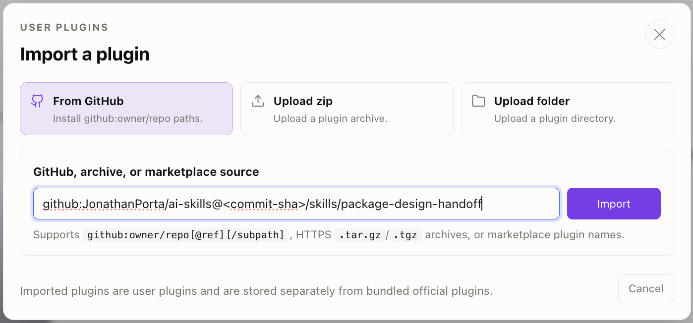
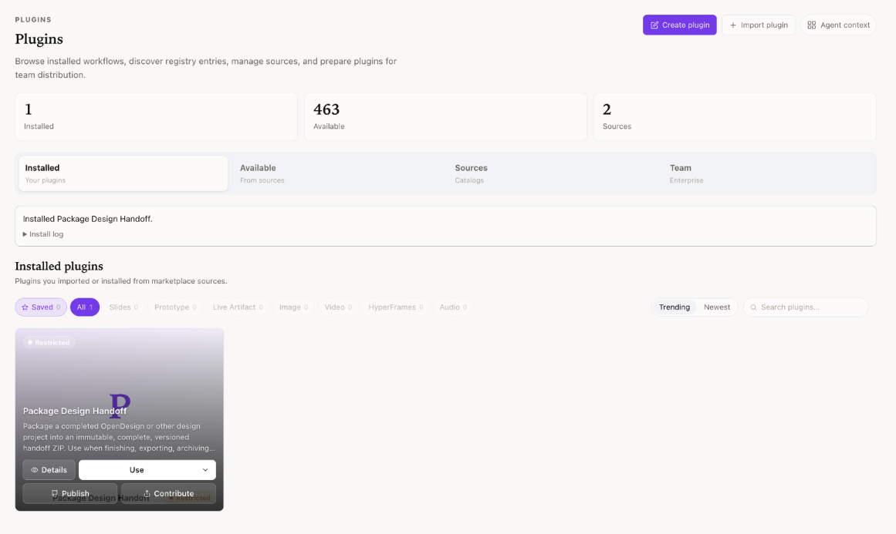
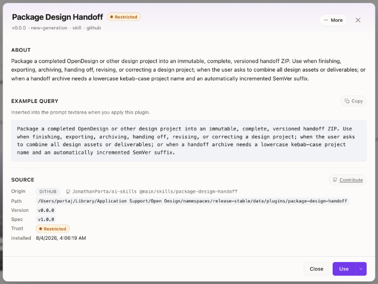
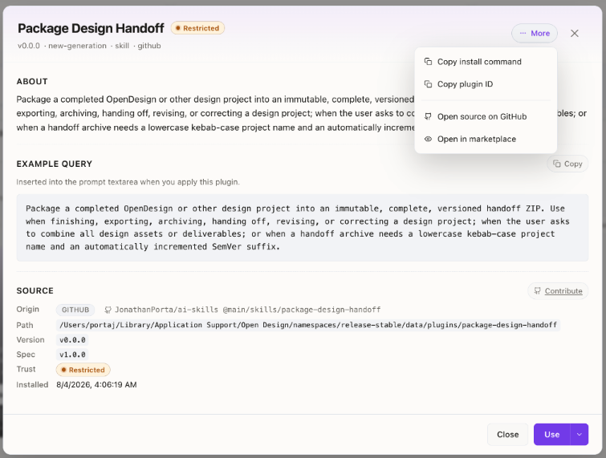
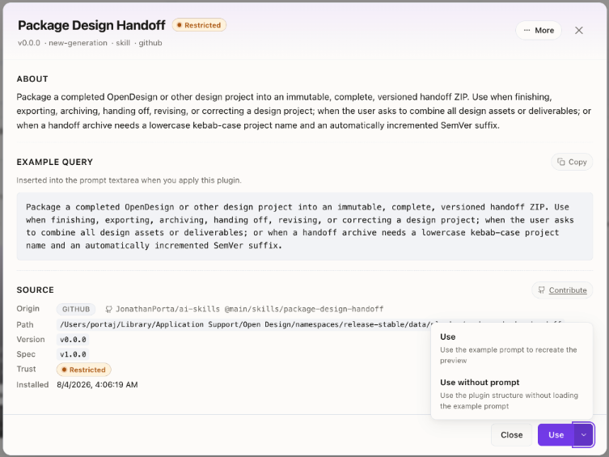

# Package Design Handoff

`package-design-handoff` turns a completed Open Design or other design project
into an immutable, versioned delivery ZIP. It exists to make the final handoff
automatic instead of relying on someone to remember the archive convention at
the end of every project.

The skill:

- names archives `<lowercase-kebab-project>-<MAJOR.MINOR.PATCH>.zip`;
- starts at `0.1.0` and chooses an appropriate patch, minor, or major increment;
- recognizes older `-vX.Y.Z.zip` archives while emitting the canonical format;
- packages editable sources, exports, prototypes, assets, code, and handoff notes;
- excludes version-control internals, dependency trees, caches, temporary files,
  and previous handoff ZIPs from the same project series;
- fails closed on credential-like files unless an exact path is reviewed for
  exclusion or explicit inclusion;
- rejects symlinked controls and non-portable or colliding ZIP entry names;
- adds a manifest, checksums, and handoff notes under `_handoff/`; and
- validates and fsyncs a private archive before atomic no-clobber publication.

The helper requires Python 3.10 or newer and has no third-party dependencies.

## Install in Open Design

Open Design's desktop Plugins UI accepts a standard Agent Skills directory as a
minimal plugin. No repository clone is required for this installation path:

1. Open **Plugins**.
2. Select **Import plugin**, then **From GitHub**.
3. Enter the complete repository subpath below.
4. Select **Import**.
5. Open **Details** on the installed card, then select **Use** to insert the
   example prompt or **Use without prompt** to apply only the plugin structure.

```text
github:JonathanPorta/ai-skills@main/skills/package-design-handoff
```

Import the individual skill directory, not the repository root. A successful
minimal import currently appears as **Package Design Handoff**, version `v0.0.0`,
kind `skill`, task kind `new-generation`, and trust `Restricted`. Those values
are synthesized by Open Design because this portable skill does not currently
ship an `open-design.json` sidecar.

<details>
<summary>Open Design installation screenshots</summary>











</details>

### Update an Open Design installation

A GitHub plugin import is copied into Open Design's local plugin registry. It is
not a live Git checkout, and Open Design does not periodically poll `main`.
Update it explicitly by re-importing the same GitHub source or, when the Open
Design CLI is available, by running:

```bash
od plugin upgrade package-design-handoff
```

Because the recorded source contains `@main`, either update path fetches the
current contents of `main` at that time. Existing applied runs retain their
immutable plugin snapshot; later uses receive the upgraded copy.

For a reproducible installation, replace `main` with a reviewed commit SHA:

```text
github:JonathanPorta/ai-skills@<commit-sha>/skills/package-design-handoff
```

Confirm that `od` resolves to the Open Design CLI before using it; many Unix
systems already ship an unrelated octal-dump command named `od`.

### Install in the local execution agent too

Open Design's plugin registry and each local execution agent's skill registry
are separate. The current `SKILL.md`-only import creates the Open Design card and
example prompt, but it does not install the skill into Codex CLI, Claude Code, or
another selected local agent. Install the skill separately in every execution
agent that must load the complete workflow and bundled Python helper.

For Codex CLI, use the instructions below. Other agents need an equivalent
Agent Skills installation in their own configured skill directory. Codex
subagents do not need separate copies: they inherit the parent session's skill
configuration unless a custom agent explicitly overrides it. A future
Open Design sidecar that declares `od.context.skills[{ path: "./SKILL.md" }]`
could let Open Design inject and stage this plugin-local skill directly; that is
not the current repository contract.

## Get the repository for a local installation

Clone the repository to a stable location and check out a revision you have
reviewed. The symlinks below keep each filesystem-discovered harness on that
local source; review and validate future updates before moving the checkout
forward.

```bash
git clone git@github.com:JonathanPorta/ai-skills.git "$HOME/src/ai-skills"
cd "$HOME/src/ai-skills"
make check
export AI_SKILLS_REPO="$PWD"
```

Use an absolute checkout path for `AI_SKILLS_REPO` if the repository already
exists elsewhere.

## Install in an Open Design source checkout

This development path is separate from the desktop plugin import above.
Open Design's contract at commit
`517f39acde402c1a7af2189167a8d6957a3dac71` loads `SKILL.md` folders from a
source checkout's `skills/` directory. Link this repository's canonical folder
instead of copying it:

```bash
export OPEN_DESIGN_REPO="/absolute/path/to/open-design"
ln -s "$AI_SKILLS_REPO/skills/package-design-handoff" \
  "$OPEN_DESIGN_REPO/skills/package-design-handoff"
```

The shared `SKILL.md` uses strict standard Agent Skills frontmatter. The pinned
integration runs Open Design's production discovery and staging functions,
confirms the utility resolves to the non-image `prototype` path, and invokes the
packager through the staged skill copy. Ask Open Design to "package this project
for handoff" or select `package-design-handoff` from its skills UI.

Restart the Open Design daemon after adding the symlink. Do not run the command
if the destination already contains a real directory you need to keep.

The pinned Open Design CLI can inspect discovered skills but cannot install
them. After restarting the daemon, verify the source-checkout link with:

```bash
od skills list
od skills show package-design-handoff
```

Do not use the retired singular install command. Re-test newer Open Design
revisions before expanding the compatibility claim. An `open-design.json`
sidecar is not needed for this source-checkout workflow; marketplace/plugin
distribution is a separate contract.

## Install in Codex

Codex discovers user-wide skills in `$HOME/.agents/skills` and follows symlinked
skill directories:

```bash
mkdir -p "$HOME/.agents/skills"
ln -s "$AI_SKILLS_REPO/skills/package-design-handoff" \
  "$HOME/.agents/skills/package-design-handoff"
```

For one repository only, link it under that repository's `.agents/skills/`
directory instead:

```bash
mkdir -p .agents/skills
ln -s "$AI_SKILLS_REPO/skills/package-design-handoff" \
  .agents/skills/package-design-handoff
```

Codex normally detects the new skill automatically; restart Codex if it does not
appear. Invoke it explicitly as `$package-design-handoff`, or ask Codex to
package, archive, export, or hand off a completed design project.

## Run the helper directly

The skill normally runs the bundled helper through the active agent. It can also
be called directly:

```bash
python3 "$AI_SKILLS_REPO/skills/package-design-handoff/scripts/package_handoff.py" \
  /absolute/path/to/project \
  --project-name "Human Project Name" \
  --bump patch \
  --bump-reason "Corrected responsive states and completed icon exports"
```

Run the helper with `--help` for explicit-version, output-directory, and custom
exclusion options. Credential-like files require either an exact `--exclude`
path or a deliberately reviewed exact `--include-sensitive` path; globs do not
count as credential review.
